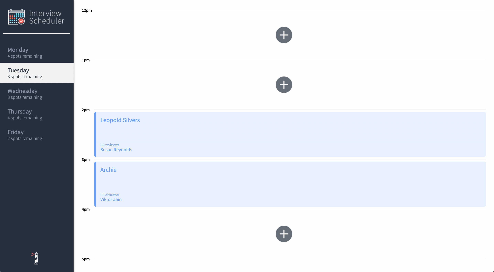
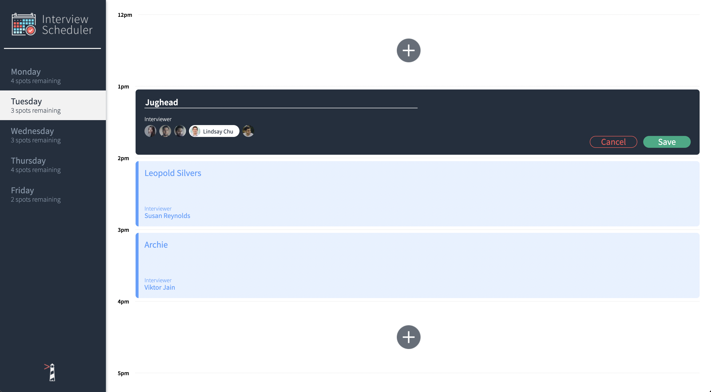
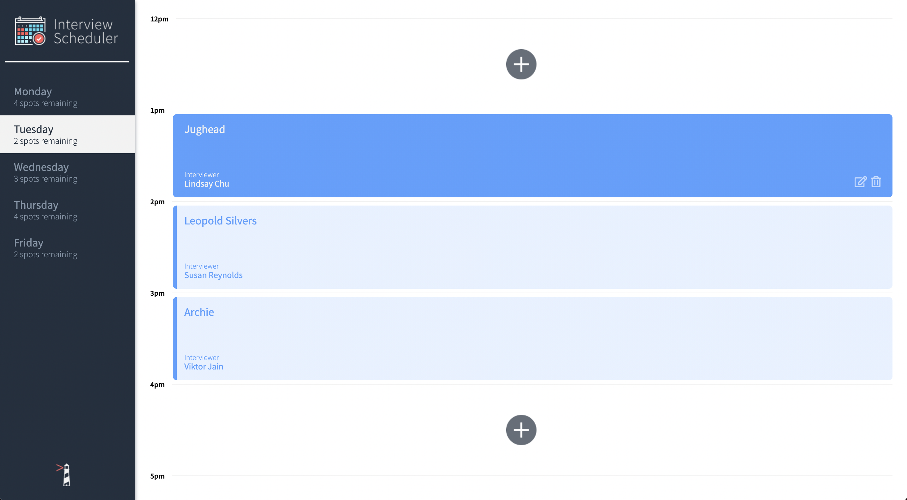
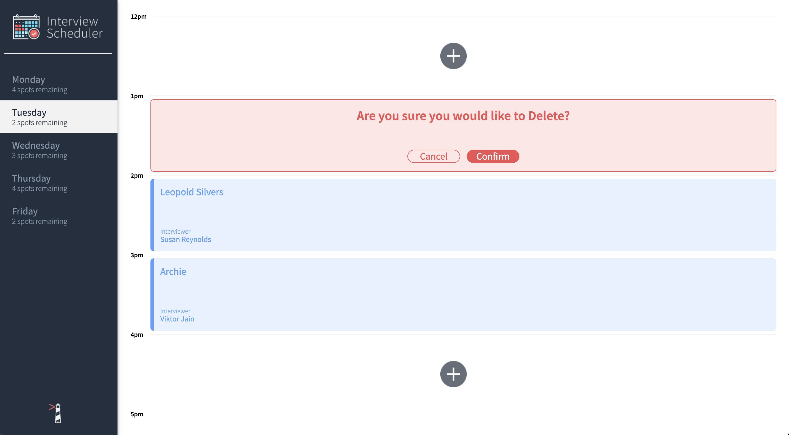

# Interview Scheduler

## Summary
This is a single page application (SPA) called Interview Scheduler, built using React.

Data is persisted by the API server using a PostgreSQL database.

The client application communicates with an API server over HTTP, using the JSON format.

Jest tests are used through the development of the project.

## Screenshots
### View Appointments


### Add a New Appointment


### Edit or Delete an Existing Appointment


Confirm before Deleting an Existing Appointment



## Details
Interviews can be booked between Monday and Friday.

A user can switch between weekdays.

A user can book an interview in an empty appointment slot.

Interviews are booked by typing in a student name and clicking on an interviewer from a list of available interviewers.

A user can cancel an existing interview.

A user can edit the details of an existing interview.

The list of days informs the user how many slots are available for each day.

The expected day updates the number of spots available when an interview is booked or canceled.

A user is presented with a confirmation when they attempt to cancel an interview.

A user is shown an error if an interview cannot be saved or deleted.

A user is shown a status indicator while asynchronous operations are in progress.

When the user presses the close button of the error they are returned to the Form or Show view (skipping Status and Confirm).

The application makes API requests to load and persist data. We do not lose data after a browser refresh.

## Technical Specifications
- React
- Webpack, Babel
- Axios
- Storybook, Webpack Dev Server, Jest, Testing Library
- The Scheduler client application is created using Create React App. Express is the basis for the Scheduler API server application. Both servers run concurrently; requests are proxied from the Webpack development server to the API server.

## Setup

Install dependencies with `npm install`.

## Running Webpack Development Server

```sh
npm start
```

## Running Jest Test Framework

```sh
npm test
```

## Running Storybook Visual Testbed

```sh
npm run storybook
```
